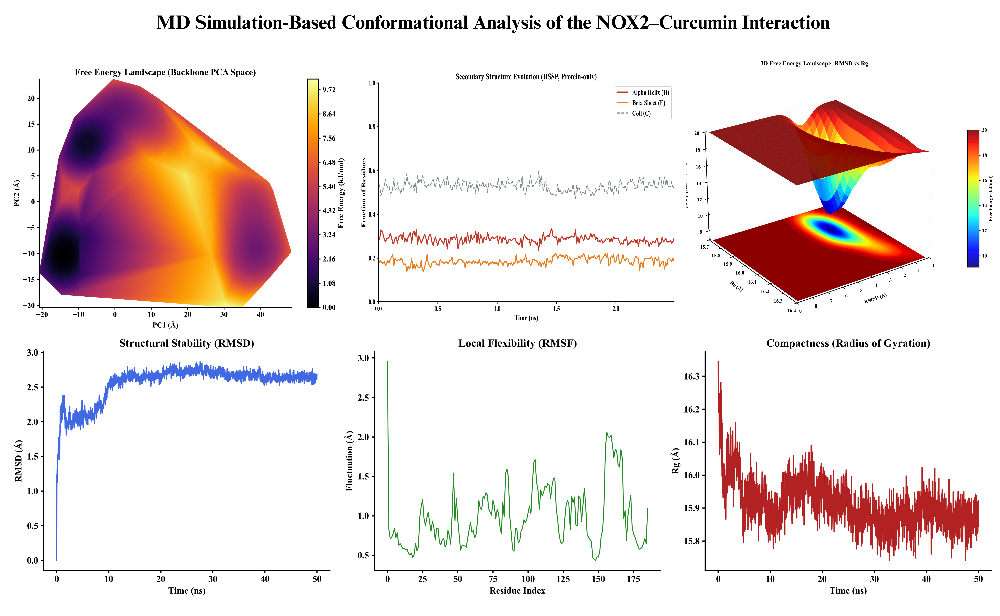

# MD Toolkit

[](https://www.python.org/downloads/)
[](https://opensource.org/licenses/MIT)
[](https://github.com/psf/black)

An end-to-end toolkit for running molecular dynamics simulations and analyzing the resulting trajectories.



---

## Features

### Simulation Engine (`simulate.py`)
- **OpenMM-based MD runner** — reads YAML configuration and executes full simulation pipelines
- **Flexible system setup** — supports PDB inputs, force fields (AMBER14, CHARMM36), and explicit solvent
- **Configurable protocols** — energy minimization, NVT/NPT equilibration, and production runs
- **Automated output** — writes trajectories in DCD format with configurable reporters

### Analysis Suite (`analyses.py`)

The analysis module provides eight core analysis functions, each paired with a dedicated plotting routine:

#### 1. Structural Stability
- **RMSD** (Root Mean Square Deviation) — backbone alignment against reference structure
- **RMSF** (Root Mean Square Fluctuation) — per-residue flexibility (Cα atoms)
- **Rg** (Radius of Gyration) — global compactness metric

```python
data = compute_rmsd_rmsf_rg(traj, dt_ps=20.0, plot_unit="A")
plot_rmsd_rmsf_rg(data, outdir="output", protein="NFKB")
```
**Output:** `MD_Analysis_Summary.png` — three-panel figure (RMSD vs time, RMSF per residue, Rg vs time)

---

#### 2. Principal Component Analysis (PCA)
- Dimensionality reduction on backbone coordinates
- Explained variance quantification
- PC space trajectory projection

```python
pca_data = compute_pca(traj, dt_ps=20.0, n_components=2, random_state=0)
plot_pca_fel(pca_data, outdir="output", protein="NFKB", T_K=310.0)
```
**Outputs:**
- `FEL_PCA_Backbone.png` — Free energy landscape in PC1–PC2 space (KDE-based)
- `PCA_scatter_time.png` — PC trajectory colored by simulation time

**Algorithm:**
- Flattens backbone coordinates into feature vectors
- Applies `sklearn.decomposition.PCA`
- Prints explained variance for top components

---

#### 3. Free Energy Landscape (RMSD vs Rg)
- 2D/3D free energy surfaces from RMSD and radius of gyration
- Histogram-based density estimation with Gaussian smoothing
- Thermodynamic weighting: ΔG = -kB T ln(P)

```python
rmsd = data["rmsd"]
rg = data["rg"]
fel = build_fel_rmsd_rg(rmsd, rg, bins=30, sigma=1.9, T_K=310.0)
plot_fel_2d(fel, outdir="output", protein="NFKB")
plot_fel_3d(fel, outdir="output", protein="NFKB")
```
**Outputs:**
- `FEL_RMSD_RG_2D.png` — contour map
- `FEL_RMSD_RG_3D.png` — surface plot

---

#### 4. Secondary Structure (DSSP)
- Per-residue assignment using simplified DSSP algorithm
- Time evolution of helix, sheet, and coil fractions
- Configurable stride for computational efficiency

```python
dssp = compute_dssp(traj, stride=10, dt_ps=20.0)
plot_dssp(dssp, outdir="output", protein="NFKB")
```
**Output:** `DSSP_SecondaryStructure_Fractions.png`

**Implementation:**
- Uses `mdtraj.compute_dssp(simplified=True)`
- Classifies into three states: `H` (helix), `E` (sheet), `C` (coil)

---

#### 5. Hydrogen Bond Analysis
- Frame-by-frame H-bond counting using **Baker-Hubbard criterion**
- Persistent bond identification with occupancy thresholds
- Donor–acceptor residue pair tracking

```python
hbonds = compute_hbonds(traj, dt_ps=20.0, freq_threshold=0.3)
plot_hbonds(hbonds, outdir="output", protein="NFKB")
```
**Output:** `HBonds_Count_Time.png` — H-bond count vs time with rolling average

**Note:** This analysis is computationally intensive for large trajectories due to per-frame geometry checks.

---

#### 6. Solvent-Accessible Surface Area (SASA)
- Per-frame SASA calculation using Shrake-Rupley algorithm
- Unit-aware output (Ångström² or nm²)

```python
sasa = compute_sasa(traj, dt_ps=20.0, pl_unit="A")
plot_sasa(sasa, outdir="output", protein="NFKB")
```
**Output:**
 `SASA_Time.png`

---

#### 7. Residue Contact Maps
- Mean inter-residue distance matrix calculation
- Contact probability mapping

```python
contacts = compute_contact_map(traj, selection="protein")
plot_contact_map(contacts, outdir="output", protein="NFKB")
```

**Output:** `Contact_Map.png`

---

## Installation

1. Clone the repository:
```bash
git clone https://github.com/username/mdtoolkit.git
cd mdtoolkit
```

2. Create and activate a conda environment:
```bash
conda create -n md-env python=3.9 -y
conda activate md-env
conda install -c conda-forge openmm mdtraj pandas numpy pyyaml scikit-learn matplotlib
```

---

## Usage

### 1. Configuration
Modify `config/config.yaml` to specify your force field, input PDB, and simulation parameters.

### 2. Run Simulation
```bash
python simulate.py --config config/config.yaml
```

### 3. Run Analysis
```bash
python -m src.analyses --config config/config.yaml --traj data/trajectory.dcd --top data/topology.pdb
```

---

## Development

The toolkit follows a modular "Compute vs Plot" design:
- `analyses.py`: Analytical engines returning dictionary-based results
- `plotting.py`: Centralized styling and visualization layer
- `simulate.py`: OpenMM pipeline management

Figures are automatically generated with scientific captions including protein name, temperature, and force field metadata.

---
